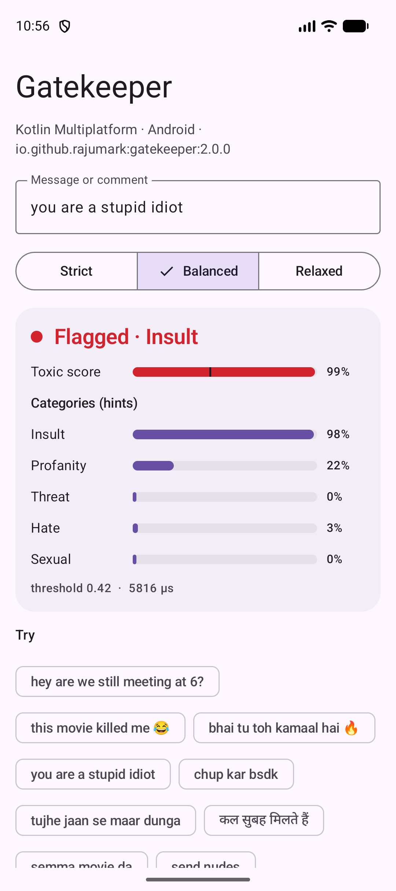
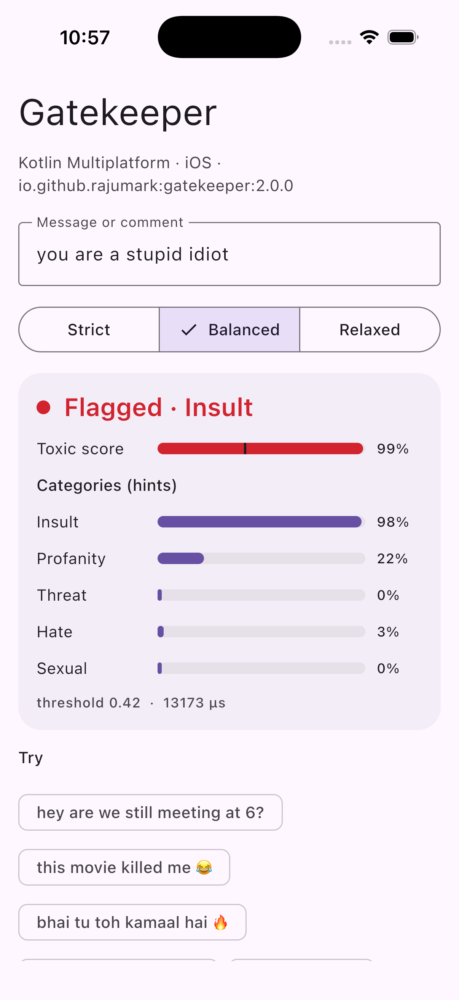
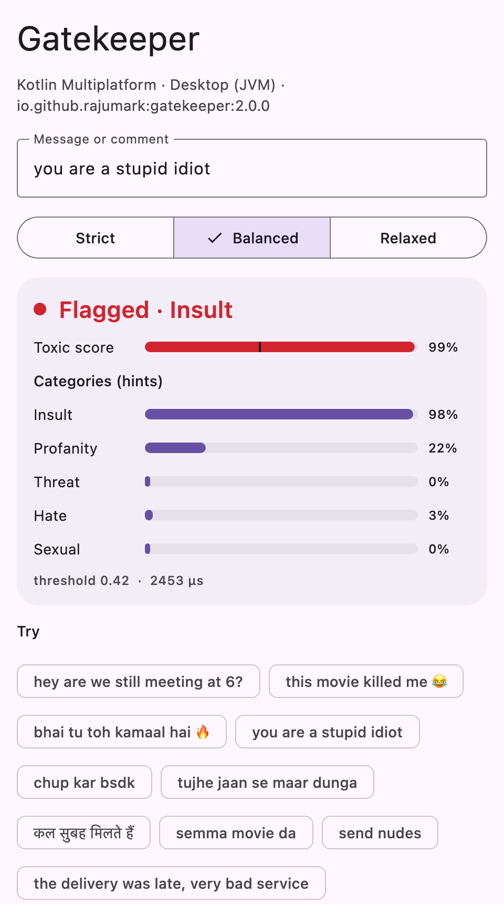
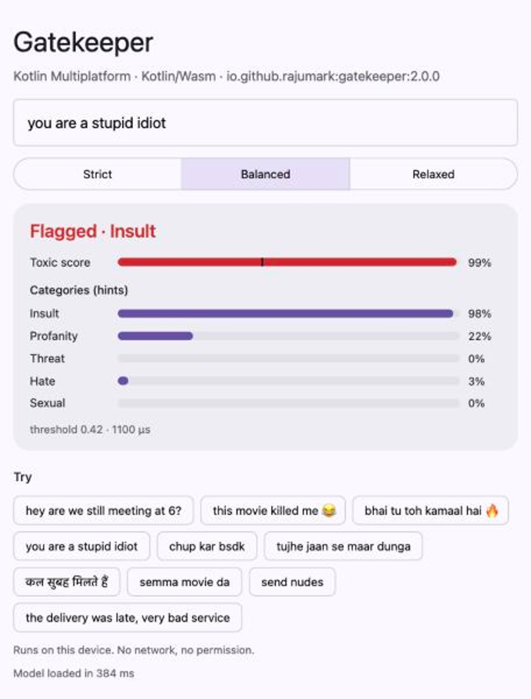

# Gatekeeper 🛡️

By Hoverfly. On-device toxic message detection for **Kotlin Multiplatform**: Android, iOS, macOS, JVM desktop, JavaScript and WebAssembly. It reads a chat message, comment or review and tells you
whether it is toxic: abusive, offensive, hateful, threatening or sexual harassment.

```kotlin
import io.github.rajumark.hoverfly.gatekeeper.Gatekeeper

Gatekeeper().use { gk ->
    gk.check("tujhe jaan se maar dunga")   // Verdict(isToxic=true, score=0.98, topCategory=THREAT)
    gk.isToxic("bhai tu toh kamaal hai")    // false
}
```

- **Made for Indian chat.** Native Hindi, Tamil, Telugu, Malayalam and Kannada, romanised Hinglish and Tanglish,
  and English, plus about 15 other languages. Catches misspellings like *f\*ck* and *chutiyaaa*.
- **Few false alarms.** 98.8% of everyday chat messages pass. Slang like *"this movie killed me 😂"* stays clean.
- **No dependencies.** Inference is plain Kotlin. There is no ONNX Runtime, TFLite, ML Kit or native code, so the
  library adds about 4 MB to an app.
- **Private and offline.** The model ships inside the library on every platform. There is no network, no permission and no telemetry.
- **Fast.** About 1 ms per message on an Android emulator once warm; the model loads in about 50 ms.
- **Every platform, same results.** Android, iOS, macOS, JVM desktop, JavaScript and WebAssembly, tested against the reference model on each.

## Install

```kotlin
// build.gradle.kts: commonMain, or any platform source set
dependencies {
    implementation("io.github.rajumark:gatekeeper:2.0.0")
}
```

It's on Maven Central, so no extra repository is needed. Gradle picks the right artifact for each platform:

| Platform | Artifact |
|---|---|
| Android (minSdk 21) | `gatekeeper-android` |
| JVM desktop (Java 8+) | `gatekeeper-jvm` |
| iOS device and simulator (arm64) | `gatekeeper-iosarm64`, `gatekeeper-iossimulatorarm64` |
| macOS (arm64) | `gatekeeper-macosarm64` |
| JavaScript (browser, Node) | `gatekeeper-js` |
| WebAssembly (browser, Node) | `gatekeeper-wasm-js` |

The Android-only 1.x releases are on JitPack: `com.github.rajumark:gatekeeper:v1.x`.

Upgrading from 1.x on Android: `Gatekeeper(context)` still compiles in Kotlin (deprecated). The model no longer needs a `Context`, so switch to `Gatekeeper()`. Java code must change `new Gatekeeper(context)` to `new Gatekeeper()`.

## Screenshots

The sample app on an emulator. Every verdict is computed on the device.

| Slang passes | Threat caught | Insult caught |
|---|---|---|
|  |  |  |
| "bhai tu toh kamaal hai 🔥" → Looks fine | "tujhe jaan se maar dunga" → Threat | "you are a stupid idiot" → Insult |

The KMP sample on each platform:

| Android | iOS | Desktop | Web (Wasm) |
|---|---|---|---|
|  |  |  |  |

## Use

```kotlin
import io.github.rajumark.hoverfly.gatekeeper.Gatekeeper
import io.github.rajumark.hoverfly.gatekeeper.Sensitivity

val gatekeeper = Gatekeeper()     // loads the model: do it off the main thread, keep one instance

val v = gatekeeper.check("you are a stupid idiot")
v.isToxic                                 // true
v.score                                   // 0.99
v.topCategory                             // INSULT
v.categories                              // {INSULT=0.98, PROFANITY=0.22, THREAT=0.0, HATE=0.03, SEXUAL=0.0}

gatekeeper.check(message, Sensitivity.STRICT)   // catch more
gatekeeper.check(message, threshold = 0.6f)     // your own threshold
gatekeeper.score(message)                        // just the score, 0..1

gatekeeper.close()                        // frees the model's memory
```

`check()` is thread-safe. A blank message is never toxic.

With coroutines:

```kotlin
val gatekeeper = withContext(Dispatchers.Default) { Gatekeeper() }
```

From Java:

```java
try (Gatekeeper gk = new Gatekeeper()) {
    Verdict v = gk.check("you are a stupid idiot");
    if (v.isToxic()) { /* hide it, blur it, or ask the sender to rephrase */ }
}
```

### Sensitivity

| | threshold | toxic messages caught | normal chat flagged | good for |
|---|---|---|---|---|
| `STRICT` | 0.25 | ~85% | ~2–3% | kids' apps, sending to a human moderator |
| `BALANCED` (default) | 0.42 | ~77% | ~1% | most apps |
| `RELAXED` | 0.70 | ~64% | ~0.6% | hiding messages automatically |

### API

| | |
|---|---|
| `Gatekeeper()` | Loads the bundled model. `AutoCloseable`. |
| `check(text, sensitivity = BALANCED)` / `check(text, threshold)` | Returns a `Verdict`. |
| `isToxic(text, sensitivity)`, `score(text)` | Shortcuts. |
| `Verdict(isToxic, score, categories)` | `topCategory`: the strongest category when the message is toxic. |
| `Category` | `INSULT`, `PROFANITY`, `THREAT`, `HATE`, `SEXUAL` |
| `Sensitivity` | `STRICT`, `BALANCED`, `RELAXED` |

Categories are hints and are most reliable for English. Make decisions on `isToxic` / `score`.

## Quality

Measured on held-out test sets and on 103 hand-written chat messages in 15 languages.
Each model gets its own tuned threshold.

| | Gatekeeper | Multilingual BERT toxicity classifier |
|---|---|---|
| Indian-language comments (hi, ta, te, ml, kn), F1 | **0.84** | 0.63 |
| Same comments typed in Latin letters, F1 | **0.83** | 0.65 |
| English comments, F1 | **0.63** | 0.50 |
| 15 world languages, F1 | 0.77 | **0.91** |
| Hand-written chat messages, accuracy | **88%** | 80% |
| Everyday chat not flagged | **98.8%** | 85.1% |
| Hate-speech stress test (no slurs), accuracy | 45% | **61%** |
| Size | **3.8 MB** | 711 MB |
| Latency, one message, 1 CPU thread (laptop) | **~0.1–0.4 ms** | ~16 ms |

**Where it falls short:** subtle hate against a group without slurs (*"X are vermin"*), sarcasm, and some English
idioms (*"I hate mondays"*). Treat it as a strong, fast first filter, not a final judge.

## Sample apps

`sample/` is a separate Gradle build that uses the **published** library, never the source. It resolves `io.github.rajumark` only from Maven Local, or from Maven Central with `-PgatekeeperRepo=central`. It has a Compose Multiplatform app for Android, desktop and iOS, and a web page built for both Kotlin/JS and Kotlin/Wasm.

```bash
./gradlew :gatekeeper:publishToMavenLocal
cd sample
./gradlew :androidApp:installRelease
./gradlew :desktopApp:run
./gradlew :webApp:wasmJsBrowserDevelopmentRun     # or :webApp:jsBrowserDevelopmentRun
open iosApp/iosApp.xcodeproj                       # run the iosApp scheme on a simulator
```

## Project layout

```
gatekeeper/                    the library
  src/commonMain/              public API (Gatekeeper, Verdict, Category, Sensitivity) and the model in plain Kotlin
                               (internal/: Featurizer, SentencePiece, Network, UnicodeTables)
  src/{jvm,android,apple,js,wasmJs}Main/   the only platform code: NFKC normalization + model loading
  src/modelData/               gatekeeper.bin (int8 weights) · spm_pieces.tsv (tokenizer)
  src/commonTest/              parity with the reference on 140 vectors, API, latency; runs on every target
sample/                        demo apps using the published artifacts
scripts/GenTables.java         generates UnicodeTables.kt (character classes) so every platform agrees
docs/                          website (rajumark.github.io/gatekeeper)
```

On JVM and Android the model ships as Java resources in the jar/AAR. Kotlin/Native and the web have no resources, so the build compiles it into the library (`generateEmbeddedModel`).

## Tests

```bash
./gradlew :gatekeeper:jvmTest
./gradlew :gatekeeper:testAndroidHostTest
./gradlew :gatekeeper:connectedAndroidDeviceTest              # on a connected device/emulator
./gradlew :gatekeeper:iosSimulatorArm64Test
./gradlew :gatekeeper:macosArm64Test
./gradlew :gatekeeper:jsNodeTest :gatekeeper:jsBrowserTest
./gradlew :gatekeeper:wasmJsNodeTest :gatekeeper:wasmJsBrowserTest
```

The parity tests require identical token and n-gram ids, the same verdict and probabilities within 1e-4 of the reference implementation on all 140 vectors, on every target. The current maximum difference is 5.4e-7.

## How it works

Two streams read the message: hashed character n-grams and words (robust to misspellings and mixed scripts), and
SentencePiece tokens through two small transformer layers. An MLP on both gives the toxic score and the five category
scores. Weights are int8 with one scale per row; the whole model is 3.5M parameters.

## Publishing

See [PUBLISHING.md](PUBLISHING.md).

## Pricing & license

**Free for up to 10,000 monthly active devices.** You don't need an API key, an account or a license file: add the dependency and ship. It works in commercial apps too, with no limit on how often each device runs it.

| | Community | Commercial | Custom models |
|---|---|---|---|
| **Price** | Free | Contact us | Contact us |
| **For** | Products with up to 10,000 monthly active devices per platform | Products above 10,000 monthly active devices on any platform | A model trained for your own language, domain or task |
| **Includes** | Commercial use, unlimited calls, no key or sign-up | One license per product per model, direct support, early access to updates | Designed and trained by Hoverfly, shipped as a plain Kotlin library |

**How devices are counted.** A monthly active device is a device that runs Gatekeeper at least once in a calendar month. The limit applies separately to each product, each platform (Android, iOS, web…) and each Hoverfly model. Once a product passes it, you have 30 days to get a commercial license. The library keeps working and never checks in with a server.

**Not allowed** under any tier (unless agreed in writing):

- selling or redistributing Gatekeeper or its model on its own, or inside another SDK or library
- extracting, modifying, fine-tuning or retraining the model weights
- using the model or its outputs to train or distill another model
- reverse engineering the model or its file format
- offering it as a hosted API for others

**Custom models.** Hoverfly also designs and trains small, fast on-device models for your needs: moderation, classification, language detection, smart replies and more.

**Contact** for a commercial license or a custom model: [raju348636@gmail.com](mailto:raju348636@gmail.com) or **+91 63533 21951** (call or WhatsApp).

Full terms: [Hoverfly Community License](LICENSE). Versions 1.0.0 and earlier were released under Apache-2.0.
