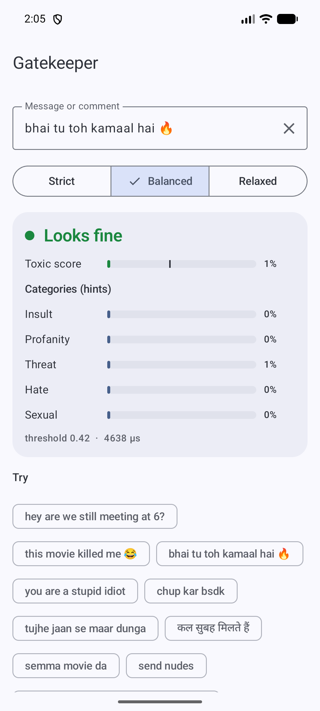
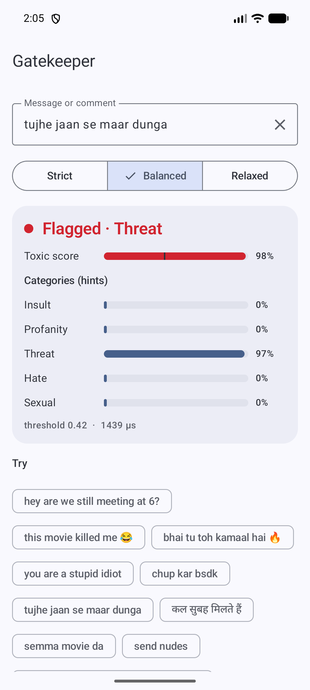
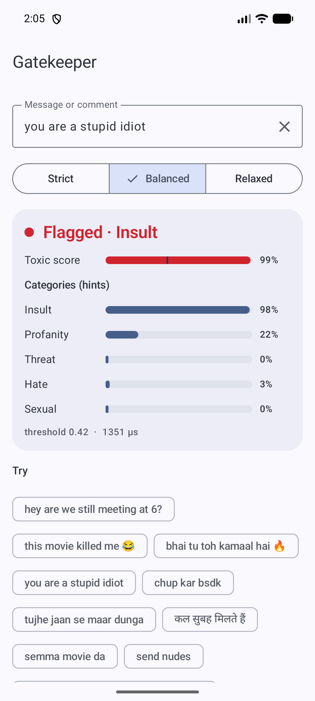

# Gatekeeper 🛡️

By Hoverfly. On-device toxic message detection for Android. It reads a chat message, comment or review and tells you
whether it is toxic: abusive, offensive, hateful, threatening or sexual harassment.

```kotlin
import io.github.rajumark.hoverfly.gatekeeper.Gatekeeper

Gatekeeper(context).use { gk ->
    gk.check("tujhe jaan se maar dunga")   // Verdict(isToxic=true, score=0.98, topCategory=THREAT)
    gk.isToxic("bhai tu toh kamaal hai")    // false
}
```

- **Made for Indian chat.** Native Hindi, Tamil, Telugu, Malayalam and Kannada, romanised Hinglish and Tanglish,
  and English, plus about 15 other languages. Catches misspellings like *f\*ck* and *chutiyaaa*.
- **Few false alarms.** 98.8% of everyday chat messages pass. Slang like *"this movie killed me 😂"* stays clean.
- **No dependencies.** Inference is plain Kotlin. There is no ONNX Runtime, TFLite, ML Kit or native code, so the
  library adds about 4 MB to an APK.
- **Private and offline.** The model ships inside the AAR. There is no network, no permission and no telemetry.
- **Fast.** About 1 ms per message on an Android emulator once warm; the model loads in about 50 ms.
- **minSdk 21.** Works from Kotlin and Java.

## Install

Available via [JitPack](https://jitpack.io/#rajumark/gatekeeper):

```kotlin
// settings.gradle.kts
dependencyResolutionManagement {
    repositories {
        mavenCentral()
        maven { url = uri("https://jitpack.io") }
    }
}

// build.gradle.kts
dependencies {
    implementation("com.github.rajumark:gatekeeper:v1.0.0")
}
```

## Screenshots

The sample app on an emulator. Every verdict is computed on the device.

| Slang passes | Threat caught | Insult caught |
|---|---|---|
|  |  |  |
| "bhai tu toh kamaal hai 🔥" → Looks fine | "tujhe jaan se maar dunga" → Threat | "you are a stupid idiot" → Insult |

## Use

```kotlin
import io.github.rajumark.hoverfly.gatekeeper.Gatekeeper
import io.github.rajumark.hoverfly.gatekeeper.Sensitivity

val gatekeeper = Gatekeeper(context)     // loads the model: do it off the main thread, keep one instance

val v = gatekeeper.check("you are a stupid idiot")
v.isToxic                                 // true
v.score                                   // 0.99
v.topCategory                             // INSULT
v.categories                              // {INSULT=0.98, PROFANITY=0.22, THREAT=0.0, HATE=0.03, SEXUAL=0.0}

gatekeeper.check(message, Sensitivity.STRICT)   // catch more
gatekeeper.check(message, threshold = 0.6f)     // your own threshold
gatekeeper.score(message)                        // just the score, 0..1

gatekeeper.close()                        // frees the model's heap memory
```

`check()` is thread-safe. A blank message is never toxic.

With coroutines:

```kotlin
val gatekeeper = withContext(Dispatchers.Default) { Gatekeeper(context) }
```

From Java:

```java
try (Gatekeeper gk = new Gatekeeper(context)) {
    Verdict v = gk.check("you are a stupid idiot");
    if (v.isToxic()) { /* hide it, blur it, or ask the sender to rephrase */ }
}
```

### Sensitivity

| | threshold | toxic messages caught | normal chat flagged | good for |
|---|---|---|---|---|
| `STRICT` | 0.25 | ~85% | ~2–3% | kids' apps, sending to a human moderator |
| `BALANCED` (default) | 0.42 | ~77% | ~1% | most apps |
| `RELAXED` | 0.70 | ~64% | ~0.6% | hiding messages automatically |

### API

| | |
|---|---|
| `Gatekeeper(context)` | Loads the bundled model. `Closeable`. |
| `check(text, sensitivity = BALANCED)` / `check(text, threshold)` | Returns a `Verdict`. |
| `isToxic(text, sensitivity)`, `score(text)` | Shortcuts. |
| `Verdict(isToxic, score, categories)` | `topCategory`: the strongest category when the message is toxic. |
| `Category` | `INSULT`, `PROFANITY`, `THREAT`, `HATE`, `SEXUAL` |
| `Sensitivity` | `STRICT`, `BALANCED`, `RELAXED` |

Categories are hints and are most reliable for English. Make decisions on `isToxic` / `score`.

## Quality

Measured on held-out test sets never used for training, and on 103 hand-written chat messages in 15 languages.
Each model gets its own tuned threshold.

| | Gatekeeper | Multilingual BERT toxicity classifier |
|---|---|---|
| Indian-language comments (hi, ta, te, ml, kn), F1 | **0.84** | 0.63 |
| Same comments typed in Latin letters, F1 | **0.83** | 0.65 |
| English comments, F1 | **0.63** | 0.50 |
| 15 world languages, F1 | 0.77 | **0.91** |
| Hand-written chat messages, accuracy | **88%** | 80% |
| Everyday chat not flagged | **98.8%** | 85.1% |
| Hate-speech stress test (no slurs), accuracy | 45% | **61%** |
| Size | **3.8 MB** | 711 MB |
| Latency, one message, 1 CPU thread (laptop) | **~0.1–0.4 ms** | ~16 ms |

**Where it falls short:** subtle hate against a group without slurs (*"X are vermin"*), sarcasm, and some English
idioms (*"I hate mondays"*). Treat it as a strong, fast first filter, not a final judge.

## Sample app

`sample/` is a Jetpack Compose (Material 3) demo: type or pick a message and see the verdict, the score against the
threshold, the category scores, and a Strict / Balanced / Relaxed switch.

```bash
./gradlew :sample:installDebug
```

## Project layout

```
gatekeeper/           the library (AAR)
  src/main/assets/gatekeeper/   gatekeeper.bin (int8 weights) · spm_pieces.tsv (tokenizer)
  src/main/kotlin/io/github/rajumark/hoverfly/gatekeeper/          public API: Gatekeeper, Verdict, Category, Sensitivity
  src/main/kotlin/io/github/rajumark/hoverfly/gatekeeper/internal/ Featurizer, SentencePiece, Network (the model in plain Kotlin)
  src/test/           JVM tests: parity with the reference on 140 vectors, API, latency
  src/androidTest/    the same parity check on a real device (Android ICU)
sample/               demo app
```

## Tests

```bash
./gradlew :gatekeeper:testDebugUnitTest                        # JVM: parity + API
./gradlew :gatekeeper:connectedDebugAndroidTest                # on a connected device/emulator
```

The parity tests require identical featurizer ids and the same verdict as the reference implementation on all 140
vectors, with scores within 1e-4 (the current maximum difference is 5e-7).

## How it works

Two streams read the message: hashed character n-grams and words (robust to misspellings and mixed scripts), and
SentencePiece tokens through two small transformer layers. An MLP on both gives the toxic score and the five category
scores. Weights are int8 with one scale per row; the whole model is 3.5M parameters.

## Publishing

See [PUBLISHING.md](PUBLISHING.md).

## License

Apache-2.0.
